# Epic 1: Local Development Layer Process Design

**Project:** Robo Stack - Hybrid AI Development Stack
**Sprint:** Sprint 1
**Status:** Draft - Awaiting Approval
**Last Updated:** 2026-03-13
**Owner:** DevOps Lead

---

## Executive Summary

This document defines the complete process design for Epic 1: Local Development Layer setup. The Local Development Layer is the foundational infrastructure stage that enables all developers to work in a standardized, reproducible environment on their workstations.

**Scope:** This epic covers the bootstrap, configuration, and validation of the LOCAL development environment only. Cloud infrastructure (AWS) and advanced AI agent integrations are out of scope for E1.

**Success Criteria:** All developers can spin up a fully functional, consistent development environment from a single repository script within 30 minutes, with all build stories able to begin execution.

**Approval Gate:** This process design must be approved by Yeti before any E1 build stories can enter the development backlog.

---

## Project Context: Robo Stack Architecture

The Robo Stack is a hybrid AI development platform with six integrated layers:

1. **Local Development Layer** (E1 - this epic) - Ubuntu workstation with Kubernetes
2. **Source Control Layer** (E2) - Git repositories and CI/CD
3. **AI Agent Layer** (E3) - Copilot, CodeWhisperer, JetBrains AI, TabbyML, OpenDevin
4. **Cloud Infrastructure** (E4) - AWS EC2, VPC, optional EKS
5. **Security & Compliance** (E5) - IAM, encryption, scanning
6. **Monitoring & Observability** (E6) - Logging, metrics, dashboards

### Target Hardware Specifications

**Optimal:**
- OS: Ubuntu 22.04 LTS or later
- RAM: 16 GB
- CPU: 8-core processor
- Storage: 50 GB SSD available for containers/images

**Minimum Viable:**
- OS: Ubuntu 22.04 LTS
- RAM: 8 GB
- CPU: 4-core processor
- Storage: 30 GB SSD available

---

## Process Overview

The Local Development Layer setup is organized into 6 sequential stages, each with defined inputs, process steps, outputs, and gate criteria. Stages must be completed in order due to dependencies.

```
Stage 1: Workstation Bootstrap
        ↓
Stage 2: Container Runtime
        ↓
Stage 3: Local Kubernetes Cluster
        ↓
Stage 4: Git Workflow
        ↓
Stage 5: CI/CD Pipeline
        ↓
Stage 6: Security Baseline
        ↓
[COMPLETE - Ready for E1 Build Stories]
```

---

## Stage 1: Workstation Bootstrap

### Purpose
Prepare the Ubuntu workstation with essential system-level packages and tools required for all downstream stages.

### Inputs
- Ubuntu 22.04 LTS (or later) fresh installation or updated system
- User with sudo privileges
- Internet connectivity to package registries
- Minimum 8 GB RAM available

### Process Steps

1. **Clone the bootstrap repository**
   ```bash
   git clone https://github.com/[org]/robo-stack.git ~/robo-stack
   cd ~/robo-stack
   ```

2. **Review the bootstrap manifest** (`scripts/bootstrap/packages.txt`)
   - Document required packages: Git, Docker, kubectl, Helm, Terraform, VS Code, GitHub CLI, Node.js LTS, Python 3.10+
   - Verify no custom forks or non-standard versions are listed

3. **Run the idempotent setup script**
   ```bash
   bash scripts/bootstrap/install-workstation.sh
   ```
   - Script must be idempotent (safe to run multiple times)
   - Checks for already-installed packages
   - Uses apt package manager for base packages
   - Handles Node.js version management via nvm
   - Validates Python 3.10+ installation

4. **Verify installations**
   ```bash
   scripts/bootstrap/verify-workstation.sh
   ```
   - Confirms each required tool is installed
   - Checks version compatibility (e.g., kubectl 1.24+, Helm 3.10+)
   - Generates validation report: `workstation-validation.txt`

5. **Create development directory structure**
   ```bash
   mkdir -p ~/dev/{projects,scratch,containers}
   chmod 755 ~/dev
   ```

6. **Configure shell environment**
   - Add toolchain paths to `.bashrc` or `.zshrc`
   - Set `KUBECONFIG` environment variable placeholder
   - Set `DOCKER_REGISTRY` environment variable

7. **Validate bootstrap completion**
   ```bash
   source ~/.bashrc
   docker --version && kubectl version --client && helm version
   ```

### Outputs
- ✓ All base packages installed and verified
- ✓ Tools available in system PATH
- ✓ Development directory structure created
- ✓ Environment variables configured
- ✓ Validation report generated: `workstation-validation-[date].txt`

### Stage Gate: Workstation Bootstrap Complete
**What must be true before advancing to Stage 2:**
- [ ] All packages in manifest successfully installed
- [ ] `scripts/bootstrap/verify-workstation.sh` exits with code 0
- [ ] Running `which docker kubectl helm terraform code gh node python3` returns valid paths
- [ ] At least 20 GB free disk space available
- [ ] User can execute `docker ps` without sudo (docker group membership test in Stage 2)

**Validation Command:**
```bash
scripts/bootstrap/verify-workstation.sh && echo "STAGE 1 GATE PASSED" || echo "STAGE 1 GATE FAILED"
```

### Tool Requirements for Evaluation
- **nvm (Node Version Manager):** Evaluate adoption vs. system node package
- **Python version management:** Evaluate pyenv vs. system Python
- **Shell compatibility:** Bash vs. Zsh handling in setup script

### Estimated Effort
- **Automated setup time:** 8-12 minutes
- **Manual validation:** 3-5 minutes
- **Total Stage 1:** 15 minutes

---

## Stage 2: Container Runtime

### Purpose
Install, configure, and validate Docker CE as the container runtime. Configure image registry access and resource limits to ensure efficient workstation resource usage.

### Inputs
- Stage 1 complete (all base packages installed)
- Docker installation script from repo: `scripts/container/install-docker.sh`
- Docker daemon config template: `config/docker-daemon.json`
- GitHub Container Registry credentials (not yet needed, prepared for Stage 5)

### Process Steps

1. **Install Docker CE**
   ```bash
   bash scripts/container/install-docker.sh
   ```
   - Adds Docker official repository
   - Installs `docker-ce`, `docker-ce-cli`, `containerd.io`
   - Does NOT start daemon yet (done in step 3)

2. **Validate Docker installation**
   ```bash
   docker --version
   ```
   - Should return: `Docker version 24.0+` (or current stable)

3. **Configure Docker daemon**
   - Copy config template: `cp config/docker-daemon.json /etc/docker/daemon.json`
   - Edit for workstation (resource-constrained) settings:
     ```json
     {
       "log-driver": "json-file",
       "log-opts": {
         "max-size": "10m",
         "max-file": "3"
       },
       "storage-driver": "overlay2",
       "insecure-registries": [],
       "registry-mirrors": []
     }
     ```
   - Resource limits will be applied via docker run/compose (not daemon.json global)

4. **Start Docker daemon**
   ```bash
   sudo systemctl start docker
   sudo systemctl enable docker
   ```
   - Enable auto-start on boot

5. **Add current user to docker group**
   ```bash
   sudo usermod -aG docker $USER
   newgrp docker
   ```
   - Allows running docker commands without sudo
   - **Security note:** Document that docker group grants root-equivalent privileges

6. **Verify docker group membership**
   ```bash
   groups $USER  # should include 'docker'
   docker ps    # should work without sudo
   ```

7. **Configure container registry authentication (GitHub Container Registry)**
   - Create `.docker/config.json` with PAT (Personal Access Token)
   - **NOT DONE IN THIS STAGE** - Only create template: `.docker/config-ghcr.template.json`
   - Document the process for Stage 5 (CI/CD setup uses service account)

8. **Validate image pull capability**
   ```bash
   docker pull alpine:latest
   docker rmi alpine:latest
   ```
   - Confirms registry connectivity and basic operation

### Outputs
- ✓ Docker CE installed (version 24.0+)
- ✓ Daemon configured with proper logging and storage driver
- ✓ Current user can run docker commands without sudo
- ✓ Daemon auto-starts on boot
- ✓ Registry authentication template created
- ✓ Test image successfully pulled and removed

### Stage Gate: Container Runtime Ready
**What must be true before advancing to Stage 3:**
- [ ] `docker ps` returns empty list (no sudo required)
- [ ] `docker --version` shows 24.0 or later
- [ ] Daemon is running: `systemctl is-active docker` returns "active"
- [ ] Daemon is enabled: `systemctl is-enabled docker` returns "enabled"
- [ ] Successfully pulled and removed test image (alpine:latest)
- [ ] `~/.docker/config-ghcr.template.json` exists
- [ ] Disk space check: At least 10 GB free for container images

**Validation Command:**
```bash
bash scripts/container/verify-docker.sh && echo "STAGE 2 GATE PASSED" || echo "STAGE 2 GATE FAILED"
```

### Tool Requirements for Evaluation
- **Container runtime:** Confirmed Docker CE (no alternatives evaluated in E1)
- **Logging driver:** json-file vs. other drivers (json-file chosen for local dev simplicity)
- **Storage driver:** overlay2 confirmed (industry standard)

### Estimated Effort
- **Docker installation:** 3-5 minutes
- **Configuration and validation:** 5-7 minutes
- **Total Stage 2:** 10 minutes

---

## Stage 3: Local Kubernetes Cluster

### Purpose
Deploy and configure a local Kubernetes cluster (K3s or Minikube, pending evaluation decision) to provide container orchestration and testing environment for applications.

### Inputs
- Stage 2 complete (Docker running and configured)
- K3s installation script: `scripts/k8s/install-k3s.sh` OR Minikube script: `scripts/k8s/install-minikube.sh`
- Namespace config: `config/k8s-namespaces.yaml`
- Resource limits config: `config/k8s-resource-limits.yaml`
- Helm repo configurations: `config/helm-repos.yaml`

### Process Steps

#### Path A: K3s Installation (Lightweight Kubernetes)

1. **Install K3s**
   ```bash
   bash scripts/k8s/install-k3s.sh
   ```
   - Installs K3s v1.27+ (matches EV1.1 evaluation outcome)
   - Configures with `--docker` flag to use Docker runtime
   - Sets appropriate memory/CPU limits for workstation

2. **Configure kubectl context**
   ```bash
   mkdir -p ~/.kube
   sudo cp /etc/rancher/k3s/k3s.yaml ~/.kube/config
   sudo chown $USER:$USER ~/.kube/config
   chmod 600 ~/.kube/config
   ```

3. **Verify cluster connectivity**
   ```bash
   kubectl cluster-info
   kubectl get nodes
   kubectl get pods --all-namespaces
   ```

4. **Create development namespaces**
   ```bash
   kubectl apply -f config/k8s-namespaces.yaml
   ```
   - Creates: `dev`, `staging`, `monitoring`
   - Creates: `default` (for quick testing)

5. **Apply resource limits to namespaces**
   ```bash
   kubectl apply -f config/k8s-resource-limits.yaml
   ```
   - Prevents runaway workloads from consuming entire workstation
   - Sets default requests/limits per namespace

6. **Install Helm 3**
   ```bash
   curl https://raw.githubusercontent.com/helm/helm/main/scripts/get-helm-3 | bash
   ```
   - Confirms Helm 3.10+ available

7. **Configure Helm repositories**
   ```bash
   bash scripts/k8s/configure-helm-repos.sh
   ```
   - Adds: stable, bitnami, prometheus-community, jetstack
   - Updates: `helm repo update`

8. **Validate Helm installation**
   ```bash
   helm version
   helm repo list
   helm search repo stable
   ```

#### Path B: Minikube Installation (Alternative)

1. **Install Minikube**
   ```bash
   bash scripts/k8s/install-minikube.sh
   ```
   - Latest stable version
   - Configures Docker driver

2. **Start Minikube cluster**
   ```bash
   minikube start --cpus=4 --memory=6144 --disk-size=20GB --vm-driver=docker
   minikube config set memory 6144
   minikube config set cpus 4
   ```

3. **Configure kubectl context**
   ```bash
   kubectl config use-context minikube
   ```

4. Continue with steps 4-8 above (Helm and namespaces)

### Selection Criterion: EV1.1 Decision
**This stage depends on evaluation gate EV1.1:** Which local Kubernetes implementation (K3s vs. Minikube)?
- **K3s:** Lightweight, production-like, better performance on constrained hardware
- **Minikube:** Simpler setup, better Windows/Mac support (not needed for E1), easier cluster reset

**Recommended:** K3s for E1 (aligns with eventual cloud deployment to EKS)

### Outputs
- ✓ Local Kubernetes cluster running (either K3s or Minikube)
- ✓ kubectl configured and authenticated
- ✓ Three namespaces created: dev, staging, monitoring
- ✓ Resource limits applied to prevent workstation overload
- ✓ Helm 3.10+ installed
- ✓ Common Helm repos available (stable, bitnami, prometheus, jetstack)
- ✓ `~/.kube/config` properly secured

### Stage Gate: Local Kubernetes Cluster Ready
**What must be true before advancing to Stage 4:**
- [ ] `kubectl cluster-info` returns cluster info without errors
- [ ] `kubectl get nodes` shows at least one Ready node
- [ ] `kubectl get namespaces` shows: default, dev, staging, monitoring
- [ ] `kubectl describe resourcequota -n dev` shows quotas applied
- [ ] `helm version` returns 3.10 or later
- [ ] `helm repo list` shows at least: stable, bitnami, prometheus-community
- [ ] `kubectl get all --all-namespaces` shows minimal services (no user workloads yet)

**Validation Command:**
```bash
bash scripts/k8s/verify-k8s.sh && echo "STAGE 3 GATE PASSED" || echo "STAGE 3 GATE FAILED"
```

### Tool Requirements for Evaluation
- **EV1.1 - Local K8s Platform:** K3s vs. Minikube evaluation (PENDING YETI DECISION)
  - Decision impacts remaining E1 and E2 work
  - K3s recommended; Minikube acceptable alternative

### Estimated Effort
- **K3s installation and configuration:** 8-12 minutes
- **OR Minikube installation:** 10-15 minutes
- **Helm setup:** 3-5 minutes
- **Total Stage 3:** 15-20 minutes

---

## Stage 4: Git Workflow

### Purpose
Establish standardized Git branching strategy, repository management, and collaboration workflows to ensure code quality and team coordination.

### Inputs
- Repository initialized and cloned: `https://github.com/[org]/robo-stack.git`
- Branch protection configuration: `config/github-branch-protection.json`
- PR template: `.github/pull_request_template.md`
- CODEOWNERS file: `.github/CODEOWNERS`
- Git configuration: `config/.gitconfig-template`

### Process Steps

1. **Clone repository and verify remote**
   ```bash
   cd ~/dev/projects
   git clone https://github.com/[org]/robo-stack.git
   cd robo-stack
   git remote -v  # verify origin is correct
   ```

2. **Configure local Git settings**
   ```bash
   # Copy and personalize git config
   cp config/.gitconfig-template ~/.gitconfig-local
   git config --local user.name "[Developer Name]"
   git config --local user.email "[developer@example.com]"
   git config --local include.path ~/.gitconfig-local
   ```
   - Includes aliases and useful settings from template

3. **Establish branch strategy**
   - Document in `docs/BRANCHING.md`:
     ```
     Main branch: main (production-ready)
     Development: feature/{epic}-{story-number}-{short-description}
     Examples:
       - feature/E1-BS1-workstation-bootstrap
       - feature/E1-BS2-docker-config
       - feature/E2-CS1-github-actions-setup
     ```
   - All work on feature branches
   - Rebase and squash merge to main

4. **Enable branch protection on main**
   - GitHub Settings → Branches → Add rule for `main`
   - Require:
     - At least 1 approval review
     - Status checks to pass (set up in Stage 5)
     - Branches up-to-date before merge
     - Dismiss stale PR reviews on new pushes
   - Allow:
     - Squash merging (primary merge strategy)
     - Force push: disabled

5. **Review and customize PR template**
   - Located: `.github/pull_request_template.md`
   - Includes checklist:
     ```
     - [ ] All tests pass locally
     - [ ] Documentation updated
     - [ ] No hardcoded secrets or credentials
     - [ ] Tested in dev namespace
     ```
   - Automatically populated on new PR

6. **Review CODEOWNERS file**
   - Located: `.github/CODEOWNERS`
   - Maps code paths to responsible teams/individuals
   - Required review enforcement via branch protection
   - Example content:
     ```
     # DevOps team owns infrastructure code
     /scripts/ @devops-team
     /config/ @devops-team
     /docs/ @dev-team
     ```

7. **Configure merge behavior**
   - Repository Settings → General:
     - Default merge method: Squash and merge
     - Automatically delete head branches: Enabled
     - Auto-merge: Disabled (manual review required)

8. **Create local test branch and validate workflow**
   ```bash
   git checkout -b feature/E1-TEST-workflow-validation
   echo "test" >> TEST.txt
   git add TEST.txt
   git commit -m "test: validate git workflow"
   git push origin feature/E1-TEST-workflow-validation
   # Create PR in GitHub UI, verify template, checks, etc.
   # Then delete branch
   ```

9. **Document Git workflow for team**
   - Create: `docs/GIT-WORKFLOW.md`
   - Cover: cloning, branching, committing, PR process, merging
   - Include: common commands and troubleshooting

### Outputs
- ✓ Repository cloned and authenticated
- ✓ Local Git configuration applied
- ✓ Branch protection enabled on main
- ✓ PR template configured
- ✓ CODEOWNERS file established
- ✓ Merge strategy set to squash
- ✓ Git workflow documentation created
- ✓ Team members can navigate branch naming and PR process

### Stage Gate: Git Workflow Ready
**What must be true before advancing to Stage 5:**
- [ ] `git remote -v` shows correct origin URL
- [ ] GitHub branch protection rule active on `main`
  - [ ] Requires at least 1 approval
  - [ ] Requires status checks to pass
- [ ] PR template visible in `.github/pull_request_template.md`
- [ ] CODEOWNERS file exists and is valid
- [ ] At least one team member can create feature branch, push, and create PR
- [ ] Test PR successfully merged using squash merge
- [ ] `docs/GIT-WORKFLOW.md` exists with clear instructions
- [ ] Default merge strategy in GitHub is "Squash and merge"

**Validation Command:**
```bash
bash scripts/git/verify-git-workflow.sh && echo "STAGE 4 GATE PASSED" || echo "STAGE 4 GATE FAILED"
```

### Tool Requirements for Evaluation
- **Git client:** Standard git CLI (no special tools needed)
- **GitHub integration:** Verified, no auth issues

### Estimated Effort
- **Repository setup:** 3-5 minutes
- **Branch protection and templates:** 5-7 minutes
- **Documentation:** 5-10 minutes
- **Total Stage 4:** 15 minutes

---

## Stage 5: CI/CD Pipeline

### Purpose
Implement continuous integration and deployment via GitHub Actions to automate testing, security scanning, and deployment to local Kubernetes cluster.

### Inputs
- Stage 4 complete (Git workflow ready)
- GitHub Actions workflow files in `.github/workflows/`:
  - `lint.yml` - Code and configuration linting
  - `test.yml` - Unit and integration tests
  - `security.yml` - SAST and dependency scanning
  - `build.yml` - Container image build
  - `deploy.yml` - Deploy to dev/staging namespaces
- GitHub Actions secrets configured (GitHub Secrets Management)
- Lint configuration: `.eslintrc`, `yamllint.yaml`, `hadolint-rules`
- Test runner configuration: `jest.config.js` (or equivalent)

### Process Steps

1. **Create GitHub Actions workflows directory**
   ```bash
   mkdir -p .github/workflows
   ```

2. **Create lint workflow** (`lint.yml`)
   ```yaml
   name: Lint
   on: [pull_request]
   jobs:
     lint:
       runs-on: ubuntu-latest
       steps:
         - uses: actions/checkout@v3
         - name: Lint YAML
           run: |
             pip install yamllint
             yamllint -c yamllint.yaml .
         - name: Lint Shell Scripts
           run: |
             apt-get update && apt-get install -y shellcheck
             find scripts -name "*.sh" -exec shellcheck {} \;
         - name: Lint Docker
           run: |
             docker run --rm -i hadolint/hadolint < Dockerfile
   ```

3. **Create test workflow** (`test.yml`)
   ```yaml
   name: Test
   on: [pull_request]
   jobs:
     test:
       runs-on: ubuntu-latest
       steps:
         - uses: actions/checkout@v3
         - name: Set up Node.js
           uses: actions/setup-node@v3
           with:
             node-version: '18'
         - name: Install dependencies
           run: npm install
         - name: Run tests
           run: npm test
         - name: Upload coverage
           uses: codecov/codecov-action@v3
   ```

4. **Create security workflow** (`security.yml`)
   ```yaml
   name: Security Scan
   on: [pull_request]
   jobs:
     codeql:
       runs-on: ubuntu-latest
       steps:
         - uses: actions/checkout@v3
         - name: Initialize CodeQL
           uses: github/codeql-action/init@v2
         - name: Build
           run: |
             npm install
             npm run build
         - name: Perform CodeQL Analysis
           uses: github/codeql-action/analyze@v2
     dependabot:
       runs-on: ubuntu-latest
       steps:
         - uses: actions/checkout@v3
         - name: Check dependencies
           run: |
             npm audit --json > audit.json
             npm audit || echo "Vulnerabilities found"
   ```

5. **Create build workflow** (`build.yml`)
   ```yaml
   name: Build
   on:
     push:
       branches: [main]
   jobs:
     build:
       runs-on: ubuntu-latest
       steps:
         - uses: actions/checkout@v3
         - name: Build Docker image
           run: |
             docker build -t ghcr.io/${{ github.repository }}:${{ github.sha }} .
             docker tag ghcr.io/${{ github.repository }}:${{ github.sha }} ghcr.io/${{ github.repository }}:latest
         - name: Push to GHCR
           run: |
             echo ${{ secrets.GITHUB_TOKEN }} | docker login ghcr.io -u $ -p -
             docker push ghcr.io/${{ github.repository }}:${{ github.sha }}
             docker push ghcr.io/${{ github.repository }}:latest
   ```

6. **Create deploy workflow** (`deploy.yml`)
   ```yaml
   name: Deploy
   on:
     push:
       branches: [main]
   jobs:
     deploy:
       runs-on: ubuntu-latest
       steps:
         - uses: actions/checkout@v3
         - name: Deploy to dev namespace
           env:
             KUBECONFIG: ${{ secrets.KUBECONFIG_BASE64 }}
           run: |
             echo $KUBECONFIG | base64 -d > kubeconfig.yaml
             kubectl --kubeconfig=kubeconfig.yaml apply -f k8s/dev/
             kubectl --kubeconfig=kubeconfig.yaml rollout status deployment/robo-stack -n dev
   ```

7. **Configure GitHub Actions secrets**
   - GitHub Settings → Secrets and variables → Actions
   - Create secrets:
     - `GHCR_TOKEN`: Personal Access Token with `write:packages` scope
     - `KUBECONFIG_BASE64`: Base64-encoded kubeconfig for deployment
   - **Security:** Only expose secrets to workflows, never in logs

8. **Configure workflow triggers**
   - PR workflows (lint, test, security):
     ```yaml
     on: [pull_request]
     ```
   - Main branch workflows (build, deploy):
     ```yaml
     on:
       push:
         branches: [main]
     ```

9. **Test pipeline by creating test PR**
   ```bash
   git checkout -b feature/E1-TEST-ci-pipeline
   echo "# Test" >> README.md
   git add README.md
   git commit -m "test: trigger CI pipeline"
   git push origin feature/E1-TEST-ci-pipeline
   ```
   - Create PR in GitHub
   - Observe workflow runs on PR
   - Verify lint, test, and security checks execute
   - Merge PR and observe build/deploy workflows

10. **Document CI/CD pipeline**
    - Create: `docs/CI-CD-PIPELINE.md`
    - Cover: workflow structure, triggers, job execution, status checks
    - Include: how to debug failing workflows

### Outputs
- ✓ All GitHub Actions workflows created and committed
- ✓ PR workflows run on pull requests: lint, test, security
- ✓ Main workflows run on merge: build, deploy
- ✓ GitHub Actions secrets configured
- ✓ Workflows use pipeline YAML files in repo (no web UI config)
- ✓ At least one test PR successfully executed all workflows
- ✓ CI/CD documentation created

### Stage Gate: CI/CD Pipeline Ready
**What must be true before advancing to Stage 6:**
- [ ] All workflow files exist in `.github/workflows/`: lint.yml, test.yml, security.yml, build.yml, deploy.yml
- [ ] At least one test PR ran successfully with all status checks passing
- [ ] Lint workflow executes and reports results
- [ ] Test workflow executes and reports results
- [ ] Security workflow (CodeQL) executes and reports results
- [ ] Build workflow can execute (may fail on secrets, but YAML is valid)
- [ ] GitHub Actions secrets are configured (GHCR_TOKEN, KUBECONFIG_BASE64)
- [ ] Documentation exists: `docs/CI-CD-PIPELINE.md`

**Validation Command:**
```bash
bash scripts/ci-cd/verify-github-actions.sh && echo "STAGE 5 GATE PASSED" || echo "STAGE 5 GATE FAILED"
```

### Tool Requirements for Evaluation
- **CI/CD platform:** GitHub Actions confirmed (no alternatives for E1)
- **Container registry:** GitHub Container Registry (GHCR) confirmed
- **Container scanning:** GitHub's built-in scanning (Advanced Security feature)

### Estimated Effort
- **Create workflow files:** 15-20 minutes
- **Configure secrets:** 5 minutes
- **Test and validate:** 10-15 minutes
- **Documentation:** 5 minutes
- **Total Stage 5:** 35-45 minutes

---

## Stage 6: Security Baseline

### Purpose
Implement security scanning, secrets management, and access control mechanisms to establish a security-first development culture.

### Inputs
- Stage 5 complete (CI/CD pipeline ready)
- Dependabot configuration: `.github/dependabot.yml`
- CodeQL configuration: `.github/codeql-config.yml`
- Secret scanning enabled in GitHub Advanced Security
- `.env` template file: `.env.example`
- Access control documentation: `docs/SECURITY-BASELINE.md`
- Least-privilege policy documentation

### Process Steps

1. **Enable GitHub Advanced Security features**
   - Repository Settings → Security & Analysis
   - Enable:
     - Dependabot alerts: ✓
     - Dependabot security updates: ✓
     - Secret scanning: ✓
     - CodeQL analysis: ✓ (already in workflow from Stage 5)

2. **Configure Dependabot** (`.github/dependabot.yml`)
   ```yaml
   version: 2
   updates:
     - package-ecosystem: "npm"
       directory: "/"
       schedule:
         interval: "weekly"
         day: "monday"
         time: "03:00"
     - package-ecosystem: "docker"
       directory: "/"
       schedule:
         interval: "weekly"
     - package-ecosystem: "github-actions"
       directory: "/"
       schedule:
         interval: "weekly"
   ```
   - Creates automated PRs for dependency updates
   - Triggers security scan workflow on update PRs

3. **Verify CodeQL configuration**
   - CodeQL workflow from Stage 5 is already configured
   - Verify language detection is correct for codebase
   - Review alerts in GitHub Security tab

4. **Create `.env` template (no real secrets)**
   ```bash
   # .env.example
   DOCKER_REGISTRY=ghcr.io
   DOCKER_REGISTRY_USER=${GITHUB_USERNAME}
   DOCKER_REGISTRY_TOKEN=<generate-and-add-locally-only>
   KUBECONFIG=~/.kube/config
   K8S_NAMESPACE=dev
   ```
   - Add to version control
   - Document: "Copy to `.env`, add real values locally only"
   - `.env` and `.env.local` in `.gitignore`

5. **Configure `.gitignore` to protect secrets**
   ```
   .env
   .env.local
   .env.*.local
   secrets/
   *.key
   *.pem
   config/secrets/
   .kube/
   ```

6. **Establish least-privilege access model**
   - Document in: `docs/SECURITY-BASELINE.md`
   - Principles:
     - GitHub token scopes: minimal required (PR: read, push: write packages)
     - Kubernetes RBAC: dev users have access to dev namespace only
     - Docker registry: credentials via GitHub Secrets (not in repo)
     - Secrets rotation: every 90 days
   - Example: GitHub token for CI/CD should NOT have admin scope

7. **Enable branch protection requirements** (reinforce Stage 4)
   - Require PR review before merge
   - Require status checks to pass (including security)
   - Dismiss stale reviews on new commits

8. **Set up centralized logging strategy**
   - Document in: `docs/LOGGING-STRATEGY.md`
   - Configure Docker daemon logging (from Stage 2):
     ```json
     "log-driver": "json-file",
     "log-opts": {
       "max-size": "10m",
       "max-file": "3"
     }
     ```
   - Configure Kubernetes logging aggregation (ready for Stage 6):
     - Log location: `/var/log/pods/`
     - Log format: JSON for structured parsing
     - Retention: 10 days local, archive older logs
   - Reserve disk space: 5 GB for logs

9. **Create security checklist for developers**
   - Document: `docs/DEVELOPER-SECURITY-CHECKLIST.md`
   - Checklist items:
     - [ ] No hardcoded secrets in commits
     - [ ] Secrets in `.env` file (not version-controlled)
     - [ ] GitHub token scopes follow least-privilege principle
     - [ ] Dependabot alerts addressed within 7 days
     - [ ] CodeQL warnings resolved or documented
     - [ ] All container images scanned before push

10. **Audit initial security posture**
    ```bash
    bash scripts/security/security-audit.sh
    ```
    - Generates report: `security-audit-[date].txt`
    - Checks for:
      - Secrets in git history
      - Unscanned dependencies
      - Unconfigured security features
      - Weak branch protection

11. **Document security baseline**
    - Create: `docs/SECURITY-BASELINE.md` (comprehensive)
    - Create: `docs/DEVELOPER-SECURITY-CHECKLIST.md` (quick reference)
    - Create: `docs/LOGGING-STRATEGY.md` (for observability)

### Outputs
- ✓ GitHub Advanced Security enabled (Dependabot, CodeQL, Secret scanning)
- ✓ Dependabot configuration active and generating PRs
- ✓ CodeQL analysis integrated in CI/CD
- ✓ Secret scanning enabled and detecting secrets
- ✓ `.env.example` template created (no real secrets)
- ✓ `.gitignore` prevents accidental secret commits
- ✓ Least-privilege access model documented
- ✓ Centralized logging strategy documented
- ✓ Initial security audit passed
- ✓ Security documentation and checklists in place

### Stage Gate: Security Baseline Complete
**What must be true before E1 is complete:**
- [ ] GitHub Advanced Security settings show:
  - [ ] Dependabot alerts: Enabled
  - [ ] Dependabot security updates: Enabled
  - [ ] Secret scanning: Enabled
  - [ ] CodeQL: Enabled (workflow active)
- [ ] `.github/dependabot.yml` exists and is valid YAML
- [ ] `.env.example` exists with no real secrets
- [ ] `.gitignore` prevents `.env` and `.env.local` commits
- [ ] `docs/SECURITY-BASELINE.md` exists and describes least-privilege model
- [ ] `docs/LOGGING-STRATEGY.md` exists with retention/archival policy
- [ ] Initial security audit passes: `scripts/security/security-audit.sh` returns 0
- [ ] Branch protection on `main` enforces status checks

**Validation Command:**
```bash
bash scripts/security/verify-security-baseline.sh && echo "STAGE 6 GATE PASSED" || echo "STAGE 6 GATE FAILED"
```

### Tool Requirements for Evaluation
- **Dependency scanning:** GitHub Dependabot confirmed
- **SAST:** GitHub CodeQL confirmed
- **Secret scanning:** GitHub's native secret scanner confirmed
- **Secrets management:** GitHub Secrets (for CI/CD), `.env.example` + local `.env` for local dev

### Estimated Effort
- **Enable security features:** 5-10 minutes
- **Configure Dependabot and CodeQL:** 5 minutes
- **Create `.env` template and `.gitignore`:** 5 minutes
- **Audit and documentation:** 10-15 minutes
- **Total Stage 6:** 25-40 minutes

---

## Process Workflow Diagram

```mermaid
graph TD
    A["START: E1 Local Development Layer"] --> B["Stage 1: Workstation Bootstrap"]

    B --> B1["Install Packages"]
    B1 --> B2["Verify Installations"]
    B2 --> BG{"Stage 1 Gate:<br/>All packages<br/>installed & verified?"}
    BG -->|No| B
    BG -->|Yes| C["Stage 2: Container Runtime"]

    C --> C1["Install Docker CE"]
    C1 --> C2["Configure Daemon"]
    C2 --> C3["Add User to Docker Group"]
    C3 --> CG{"Stage 2 Gate:<br/>Docker running<br/>& authenticated?"}
    CG -->|No| C
    CG -->|Yes| D["Stage 3: Local Kubernetes"]

    D --> D1{"EV1.1 Decision:<br/>K3s or Minikube?"}
    D1 -->|K3s| D2["Install K3s"]
    D1 -->|Minikube| D3["Install Minikube"]
    D2 --> D4["Configure kubectl & Helm"]
    D3 --> D4
    D4 --> D5["Create Namespaces"]
    D5 --> D6["Apply Resource Limits"]
    D6 --> DG{"Stage 3 Gate:<br/>K8s cluster<br/>running?"}
    DG -->|No| D
    DG -->|Yes| E["Stage 4: Git Workflow"]

    E --> E1["Clone Repository"]
    E1 --> E2["Configure Git Settings"]
    E2 --> E3["Enable Branch Protection"]
    E3 --> E4["Create PR Template"]
    E4 --> E5["Create CODEOWNERS"]
    E5 --> EG{"Stage 4 Gate:<br/>Git workflow<br/>configured?"}
    EG -->|No| E
    EG -->|Yes| F["Stage 5: CI/CD Pipeline"]

    F --> F1["Create Workflow Files"]
    F1 --> F2["Configure GitHub Secrets"]
    F2 --> F3["Test PR Execution"]
    F3 --> FG{"Stage 5 Gate:<br/>Workflows running<br/>successfully?"}
    FG -->|No| F
    FG -->|Yes| G["Stage 6: Security Baseline"]

    G --> G1["Enable Advanced Security"]
    G1 --> G2["Configure Dependabot"]
    G2 --> G3["Create .env Template"]
    G3 --> G4["Document Least-Privilege"]
    G4 --> G5["Security Audit"]
    G5 --> GG{"Stage 6 Gate:<br/>Security baseline<br/>established?"}
    GG -->|No| G
    GG -->|Yes| Z["✓ E1 COMPLETE<br/>Ready for Build Stories"]

    style A fill:#e1f5e1
    style Z fill:#e1f5e1
    style BG fill:#fff4e6
    style CG fill:#fff4e6
    style DG fill:#fff4e6
    style EG fill:#fff4e6
    style FG fill:#fff4e6
    style GG fill:#fff4e6
```



---

## Evaluation Gates (EV) - Tool Decisions Requiring Yeti Sign-Off

### EV1.1: Local Kubernetes Platform Decision
**Decision:** K3s vs. Minikube for local development

**Context:**
- K3s: Lightweight, production-like, 350 MB footprint, better on constrained hardware
- Minikube: Simpler setup, easier to reset, slower on local machine, standard in many teams

**Impact:** Affects Stage 3 process and tooling for all developers

**Recommendation:** K3s (aligns with eventual EKS deployment in E4)

**Timeline:** Must be decided before Stage 3 implementation begins

**Owner:** Yeti

**Status:** PENDING DECISION

---

## Summary of Tool Requirements

| Tool | Version | Purpose | Stage | Evaluation? |
|------|---------|---------|-------|-------------|
| Git | 2.34+ | Version control | 4 | No |
| Docker CE | 24.0+ | Container runtime | 2 | No |
| kubectl | 1.24+ | K8s CLI | 3 | No |
| K3s or Minikube | Latest | Local K8s cluster | 3 | **EV1.1** |
| Helm | 3.10+ | K8s package manager | 3 | No |
| Terraform | 1.3+ | IaC (future use) | 1 | No |
| VS Code | Latest | Editor (optional) | 1 | No |
| GitHub CLI | Latest | Git CLI extension | 1 | No |
| Node.js | 18 LTS | JS runtime | 1 | No |
| Python | 3.10+ | Python runtime | 1 | No |
| GitHub Actions | - | CI/CD platform | 5 | No |
| GitHub Advanced Security | - | Security scanning | 6 | No |

---

## Acceptance Criteria for E1 Process Design Approval

Before this process design is approved and E1 build stories can begin, the following criteria must be met:

### Process Documentation
- [ ] All 6 stages fully documented with inputs, steps, outputs, gates
- [ ] Each stage has clear, actionable process steps (numbered)
- [ ] Stage gates define exact success criteria (boolean checks)
- [ ] Estimated effort provided for each stage
- [ ] Workflow diagram shows dependencies and decision points
- [ ] All tool requirements listed and evaluated

### Process Feasibility
- [ ] Each stage can be executed by a developer in stated estimated time
- [ ] Scripts and configuration templates exist in repository (or are clearly specified for creation)
- [ ] No circular dependencies between stages
- [ ] All inputs for each stage are outputs of previous stages
- [ ] Process is idempotent (can run multiple times safely)

### Security & Standards Compliance
- [ ] Security baseline (Stage 6) addresses:
  - [ ] Secret management (no hardcoded secrets)
  - [ ] Access control (least-privilege principle)
  - [ ] Dependency scanning (Dependabot)
  - [ ] Static analysis (CodeQL)
  - [ ] Centralized logging
- [ ] All infrastructure as code (no manual setup)
- [ ] Documentation updated same day as changes

### Alignment with Robo Stack Architecture
- [ ] Design supports local development for all team members
- [ ] Process prepares infrastructure for E2 (Source Control Layer)
- [ ] Local K8s cluster mirrors eventual EKS deployment
- [ ] CI/CD foundation ready for AI agent integration (E3)

### Evaluation Gates Identified
- [ ] All tool decisions requiring Yeti input identified
- [ ] EV1.1 (Local Kubernetes platform) clearly stated with decision options
- [ ] Timeline and owner specified for each evaluation gate

### Approval Signoff
- [ ] Product Owner: ________________________ Date: ___________
- [ ] DevOps Lead: __________________________ Date: ___________
- [ ] Yeti (Final Authority): _________________ Date: ___________

---

## Total Estimated Effort: E1 Complete Setup

| Stage | Effort | Cumulative |
|-------|--------|-----------|
| Stage 1: Workstation Bootstrap | 15 min | 15 min |
| Stage 2: Container Runtime | 10 min | 25 min |
| Stage 3: Local Kubernetes | 15-20 min | 40-45 min |
| Stage 4: Git Workflow | 15 min | 55-60 min |
| Stage 5: CI/CD Pipeline | 35-45 min | 90-105 min |
| Stage 6: Security Baseline | 25-40 min | 115-145 min |
| **TOTAL** | **115-145 min** | **1.9-2.4 hours** |

**Note:** Estimated time assumes scripts and configuration templates are available. First-time execution may take 10-15% longer due to troubleshooting.

---

## Success Metrics

Upon completion of E1, the following metrics should be measurable:

1. **Developer Onboarding Time:** New developer can have fully functional environment in <2.5 hours from scratch
2. **Environment Consistency:** 100% of developers have identical toolchain versions and configurations
3. **Pipeline Reliability:** All CI/CD workflows pass consistently on first try (target: >95%)
4. **Security Posture:** Zero high-severity vulnerabilities, Dependabot alerting active
5. **Code Quality:** Linting and testing gates enforce baseline quality before merge
6. **Documentation Coverage:** All processes documented in wiki, accessible to all team members

---

## Appendix A: Repository Structure

```
robo-stack/
├── .github/
│   ├── workflows/
│   │   ├── lint.yml
│   │   ├── test.yml
│   │   ├── security.yml
│   │   ├── build.yml
│   │   └── deploy.yml
│   ├── pull_request_template.md
│   ├── CODEOWNERS
│   └── dependabot.yml
├── scripts/
│   ├── bootstrap/
│   │   ├── install-workstation.sh
│   │   ├── verify-workstation.sh
│   │   └── packages.txt
│   ├── container/
│   │   ├── install-docker.sh
│   │   └── verify-docker.sh
│   ├── k8s/
│   │   ├── install-k3s.sh
│   │   ├── install-minikube.sh
│   │   ├── configure-helm-repos.sh
│   │   └── verify-k8s.sh
│   ├── git/
│   │   └── verify-git-workflow.sh
│   ├── ci-cd/
│   │   └── verify-github-actions.sh
│   └── security/
│       ├── security-audit.sh
│       └── verify-security-baseline.sh
├── config/
│   ├── docker-daemon.json
│   ├── k8s-namespaces.yaml
│   ├── k8s-resource-limits.yaml
│   ├── helm-repos.yaml
│   ├── .gitconfig-template
│   └── github-branch-protection.json
├── k8s/
│   ├── dev/
│   │   └── deployment.yaml
│   └── staging/
│       └── deployment.yaml
├── docs/
│   ├── GIT-WORKFLOW.md
│   ├── CI-CD-PIPELINE.md
│   ├── SECURITY-BASELINE.md
│   ├── LOGGING-STRATEGY.md
│   ├── DEVELOPER-SECURITY-CHECKLIST.md
│   └── BRANCHING.md
├── .env.example
├── .gitignore
└── README.md
```

---

## Appendix B: Validation Scripts Reference

All verification scripts should follow this pattern:

```bash
#!/bin/bash
set -e

PASSED=0
FAILED=0

check_tool() {
    local tool=$1
    local version_flag=$2
    if command -v $tool &> /dev/null; then
        echo "✓ $tool installed"
        ((PASSED++))
    else
        echo "✗ $tool NOT installed"
        ((FAILED++))
    fi
}

# Run checks...
check_tool "docker" "--version"
check_tool "kubectl" "--version"
check_tool "helm" "--version"

# Summary
echo ""
echo "========================================="
echo "Validation Results: $PASSED passed, $FAILED failed"
echo "========================================="

if [ $FAILED -eq 0 ]; then
    exit 0
else
    exit 1
fi
```

---

## Appendix C: Glossary

- **Idempotent:** Can run multiple times with the same result; no side effects from repeated execution
- **CODEOWNERS:** GitHub feature that enforces review by specific team members for code paths
- **Squash merge:** Combines all commits in a feature branch into a single commit when merging to main
- **Resource quota:** Kubernetes limit on CPU, memory, and storage per namespace
- **SAST:** Static Application Security Testing (code analysis without running the code)
- **GHCR:** GitHub Container Registry (GitHub's Docker-compatible image registry)
- **kubeconfig:** Configuration file for kubectl authentication and cluster access
- **Least-privilege access:** Security principle of granting minimum necessary permissions

---

## Document History

| Version | Date | Author | Notes |
|---------|------|--------|-------|
| 1.0 | 2026-03-13 | DevOps Lead | Initial draft for E1 process design |

---

## Next Steps

1. **Yeti Review & Decision:** EV1.1 (K3s vs. Minikube) - URGENT
2. **Approval Signoff:** Process design must be approved before E1 build stories begin
3. **Repository Setup:** Ensure all scripts and templates are committed
4. **Team Communication:** Distribute process design to all developers
5. **E1 Build Stories Creation:** Based on approved process design
   - BS1: Workstation Bootstrap (depends on Stage 1 process)
   - BS2: Container Runtime (depends on Stage 2 process)
   - BS3: Local Kubernetes (depends on EV1.1 decision, Stage 3 process)
   - BS4: Git Workflow (depends on Stage 4 process)
   - BS5: CI/CD Pipeline (depends on Stage 5 process)
   - BS6: Security Baseline (depends on Stage 6 process)

---

**Document Status:** DRAFT - Awaiting Yeti Review and Approval
**Last Updated:** 2026-03-13
**Next Review:** Upon completion of EV1.1 evaluation
